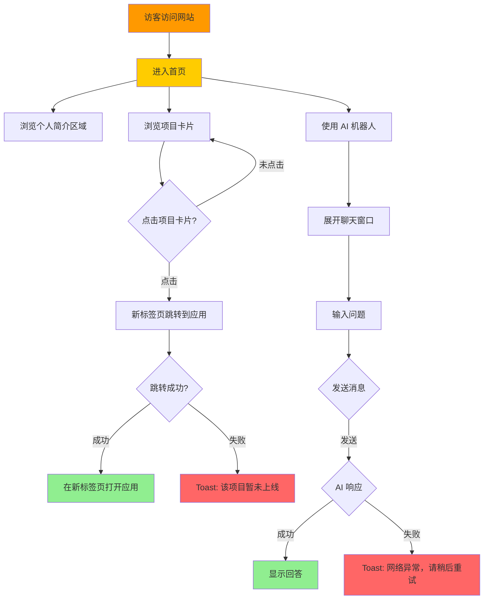

# PRD-V0.1: 七龙珠主题个人作品集 MVP

---

## 文档基础信息

| 字段 | 内容 |
|------|------|
| **PRD 版本** | V0.1 |
| **产品名称** | 个人编程作品展示网页（七龙珠主题） |
| **开发者** | Double兔 |
| **创建日期** | 2025-02-04 |
| **目标版本** | V0.1 MVP |
| **核心目标** | 最快速度上线一个能用的网站，让访客看到你的项目 |

---

## 产品概述

### 核心定位
用趣味性的七龙珠动漫主题展示个人编程作品，让作品集脱颖而出。

### 目标用户
- 潜在雇主/合作伙伴
- 访客/朋友

### 核心价值
- 趣味性强：七龙珠主题 + 角色元素
- 展示清晰：5个项目快速呈现
- 智能交互：AI 机器人解答问题

---

## 用户旅程地图



### 阶段划分
1. **抵达与概览** - 访客进入首页，快速了解站长是谁、做什么的
2. **浏览项目** - 访客浏览 5 个项目卡片，了解每个项目的基本信息
3. **跳转体验** - 访客点击项目卡片，跳转到实际的应用（核心转化）
4. **AI 问答** - 访客使用右下角的 AI 机器人询问问题（辅助功能）

---

## 用户故事

### US-01: 首页展示

**用户故事**
> 作为访客，我希望进入首页后能快速了解站长是谁、做什么的，以便决定是否继续浏览。

**业务规则与逻辑**

| 元素 | 内容 |
|------|------|
| 导航栏 | 孙悟空头像（可点击，跳转页面顶部）+ "Double兔" + [首页][文章][建议] |
| 未实现功能 | "文章"/"建议" 点击 → Toast 弹窗："即将推出，敬请期待" |
| 个人简介 | Double兔 + 标语 + 联系方式（QQ/微信: 118071452） |
| 页面背景 | 橙色→白色渐变 + 静态星星图片 |
| 版权声明 | 页面底部："七龙珠角色仅用于个人展示，非商业用途" |

**个人简介文案**
```
Double兔

VibeCoding 爱好者 | 用七龙珠的热情敲代码 | 极简主义信徒
正在开发：用 AI 让世界更有趣
目标：集齐七颗龙珠，召唤一个完美的作品集 ✨

📞 QQ/微信: 118071452
```

**异常处理**
- 无

**验收标准**
- [ ] 首页加载正常，导航栏显示正确
- [ ] 点击导航栏头像跳转到页面顶部
- [ ] 点击"文章"/"建议"显示 Toast 提示
- [ ] 个人简介文案准确显示
- [ ] 页面背景渐变 + 星星装饰正常渲染
- [ ] 底部版权声明正确显示

---

### US-02: 项目卡片浏览

**用户故事**
> 作为访客，我希望浏览项目卡片时能快速了解每个项目的名称和简介，以便决定是否点击跳转。

**业务规则与逻辑**

| 项目 | 角色 | 简介 |
|------|------|------|
| 极简记账本 | 孙悟空 🐒 | 简洁高效 |
| 个人工具主页 | 贝吉塔 🧍 | 工具集合 |
| 极简海报编辑器 | 比克 👽 | 快速创建海报 |
| AI 漫剧剧本 | 特兰克斯 ⚔ | 一键生成 |
| 自由画布 AI 对话 | 布尔玛 🔧 | 多模型对话 |

**卡片设计**

```
┌─────────────────────────────┐
│  🐒                          │ ← 角色图标（右上角装饰）
│                              │
│  极简记账本                  │ ← 项目名称
│  简洁高效                    │ ← 一句话简介
│                              │
│                  查看 →      │ ← 右下角小箭头
└─────────────────────────────┘
```

**样式与交互**
- 卡片样式：白色背景 + 圆角 + 轻微阴影
- 角色图标：右上角装饰（emoji 或 PNG，V0.1 先用 emoji）
- 查看箭头：右下角灰色小箭头
- 悬停效果：阴影加深 + 1.05 倍放大
- 交互：整卡可点

**响应式布局**
- 桌面端（>768px）：第一行 3 个，第二行 2 个
- 移动端（≤768px）：竖排单列

**异常处理**
- 无

**验收标准**
- [ ] 5 个项目卡片正确显示
- [ ] 桌面端 3+2 布局正常
- [ ] 移动端竖排布局正常
- [ ] 悬停时卡片放大效果正常
- [ ] 点击卡片触发跳转（US-03）
- [ ] 版权声明正确显示

---

### US-03: 项目跳转

**用户故事**
> 作为访客，我希望点击项目卡片后能直接跳转到对应的应用，以便体验实际产品。

**业务规则与逻辑**

| 项目 | 链接 |
|------|------|
| 极简记账本 | https://minimal-ledger.vercel.app/ |
| 个人工具主页 | https://homepage-personal-tools.vercel.app/ |
| 极简海报编辑器 | https://poster-editor-delta.vercel.app/ |
| AI 漫剧剧本 | https://app-90i4helcqosh.appmiaoda.com/ |
| 自由画布 AI 对话 | https://12f8be26246f45e9813b7f2d41dc8d35-latest.preview.enter.pro/ |

**跳转规则**
- 点击卡片 → 新标签页打开（`target="_blank"`）
- 链接为空 → Toast 提示："该项目暂未上线"
- 链接无效 → Toast 提示："该项目暂未上线"

**异常处理**
| 场景 | 处理 |
|------|------|
| 链接为空 | Toast: "该项目暂未上线" |
| 链接无效 | Toast: "该项目暂未上线" |

**验收标准**
- [ ] 点击卡片在新标签页打开对应项目
- [ ] 5 个项目链接正确跳转
- [ ] 链接无效时显示 Toast 提示

---

### US-04: AI 机器人

**用户故事**
> 作为访客，我希望通过 AI 机器人了解项目背景、站长信息等，以便更好地了解这些作品。

**业务规则与逻辑**

**外观与尺寸**
- 孙悟空头像 🐒
- 右下角浮窗
- 收起时：50x50px（小圆形头像）
- 展开时：
  - 桌面端：350x450px
  - 移动端：屏幕宽度 × 60% 高度，底部对齐

**AI 能力**
- 调用火山引擎 API（豆包/DeepSeek），API 由用户提供
- 使用 system prompt 告知项目信息（5个项目、站长简介、联系方式）
- 无需登录，任何人可用
- 不保存聊天历史

**System Prompt 内容**
```
你是 Double兔 作品集的 AI 助手。请专业、简洁、友好地回答访客问题。

站点信息：
- 站长：Double兔，VibeCoding 爱好者，用七龙珠的热情敲代码
- 联系方式：QQ/微信 118071452

项目列表：
1. 极简记账本 - 简洁高效的记账工具
2. 个人工具主页 - 常用工具集合
3. 极简海报编辑器 - 快速创建海报
4. AI 漫剧剧本 - 一键生成 AI 漫剧剧本
5. 自由画布 AI 对话 - 多模型 AI 对话工具

回答风格：专业、简洁、友好，不要使用动漫角色语气。
```

**UI 交互**
| 元素 | 设计 |
|------|------|
| 收起/展开 | 淡入淡出 + 缩放动画（300ms） |
| 聊天气泡 | 用户：蓝色右侧，AI：橙色左侧 |
| 输入框 | 底部固定，支持 Enter 发送 |
| 发送按钮 | 发送中显示"..."，恢复后变回"发送" |
| 加载状态 | AI 回复时显示"正在输入..."三点动画 |
| 头像 | 用户：默认头像，AI：孙悟空 🐒 |
| 欢迎语 | 首次展开显示："你好！我是 Double兔 的 AI 助手，有什么可以帮你的吗？" |

**异常处理**
| 场景 | 处理 |
|------|------|
| API 失败 | Toast: "抱歉，网络异常，请稍后重试" |
| 空输入 | 提示"请输入问题" |
| 连续发送 | 发送中禁用输入框 |

**验收标准**
- [ ] 右下角浮窗正常显示
- [ ] 点击头像展开/收起聊天窗口
- [ ] 欢迎语正确显示
- [ ] 输入问题后 AI 正常回复
- [ ] 聊天气泡样式正确（用户蓝色，AI 橙色）
- [ ] 发送中禁用输入框
- [ ] API 失败时显示 Toast 提示
- [ ] 移动端展开时占屏幕 60% 高度

---

## 技术架构

### 技术栈

| 层级 | 技术 |
|------|------|
| 前端框架 | Next.js 15 (App Router) |
| 语言 | TypeScript |
| 样式 | Tailwind CSS |
| 数据库 ORM | Prisma |
| 数据库 | PostgreSQL (Neon) |
| 向量库 | Upstash Vector |
| AI | 火山引擎 API（豆包/DeepSeek） |
| 部署 | Vercel |

### 数据模型（V0.1 简化版）

V0.1 暂不使用数据库，项目数据硬编码在前端。后续版本再接入数据库。

### API 设计（V0.1）

| 端点 | 方法 | 功能 |
|------|------|------|
| `/api/chat` | POST | AI 对话接口，调用火山引擎 API |

---

## 验收标准

### 功能验收
- [ ] 首页正常加载，导航栏、个人简介、背景正常显示
- [ ] 5 个项目卡片正确显示，布局正确（桌面 3+2，移动竖排）
- [ ] 点击项目卡片在新标签页打开对应链接
- [ ] AI 机器人正常工作，可发送问题并接收回复
- [ ] 所有异常处理正确显示 Toast 提示

### 兼容性验收
- [ ] Chrome 浏览器正常
- [ ] Safari 浏览器正常
- [ ] 移动端浏览器正常
- [ ] 不同屏幕尺寸响应式正常

### 核心验证点
> **你能把这个网站发给朋友看，朋友能点击项目卡片跳转到你的应用。**

---

## 非目标（V0.1 不做）

- [ ] 文章功能
- [ ] 留言板
- [ ] 角色口头禅、动画
- [ ] 后台管理系统
- [ ] 背景音乐
- [ ] 访问统计
- [ ] 项目截图
- [ ] 数据库（V0.1 用硬编码数据）
- [ ] 向量库/RAG（V0.3 再加）

---

## 附录

### 七龙珠角色图标（V0.1 使用 emoji）
| 角色 | Emoji |
|------|-------|
| 孙悟空 | 🐒 |
| 贝吉塔 | 🧍 |
| 比克 | 👽 |
| 特兰克斯 | ⚔ |
| 布尔玛 | 🔧 |

### Toast 提示汇总
| 场景 | 提示文案 |
|------|----------|
| 点击"文章"/"建议" | "即将推出，敬请期待" |
| 项目链接无效 | "该项目暂未上线" |
| AI API 失败 | "抱歉，网络异常，请稍后重试" |
| AI 空输入 | "请输入问题" |

---

*PRD 创建时间：2025-02-04*
*PRD 版本：V0.1*
*下一步：开始 V0.1 开发*
