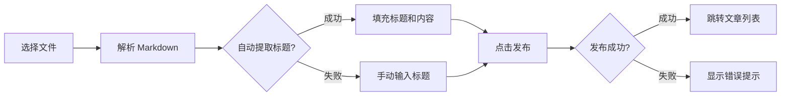

# PRD-V0.2: 七龙珠主题个人作品集 - 文章功能

---

## 文档基础信息

| 字段 | 内容 |
|------|------|
| **PRD 版本** | V0.2 |
| **产品名称** | 个人编程作品展示网页（七龙珠主题） |
| **开发者** | Double兔 |
| **创建日期** | 2025-02-04 |
| **目标版本** | V0.2 文章功能 |
| **核心目标** | 为网站增加内容展示能力，支持发布技术文章和思考记录 |

---

## 产品概述

### 核心定位
在 V0.1 MVP 基础上，增加文章系统，让网站不仅能展示项目，还能分享技术文章和思考记录，提升内容丰富度。

### 目标用户
- 潜在雇主/合作伙伴（查看技术能力深度）
- 访客/开发者（阅读技术分享）
- 站长本人（记录和沉淀技术思考）

### 核心价值
- 内容沉淀：记录技术文章和学习心得
- 能力展示：通过文章展现技术深度
- 体验优化：聊天记录本地持久化，提升用户体验

### 与 V0.1 的关系
- **继承**：V0.1 的所有功能（首页、项目卡片、AI 助手）
- **新增**：文章系统（列表、详情、上传、管理）
- **优化**：聊天记录保存、字体配置修复

---

## 用户旅程地图

```mermaid
flowchart TD
    A[访客访问网站] --> B[进入首页]

    B --> C{选择操作}
    C -->|浏览项目| D[查看项目卡片]
    C -->|阅读文章| E[点击导航栏"文章"]
    C -->|AI 问答| F[使用 AI 助手]

    E --> G[进入文章列表页]
    G --> H[浏览文章卡片]
    H --> I{点击文章?}
    I -->|点击| J[进入文章详情页]
    I -->|未点击| H

    J --> K[阅读 Markdown 文章]
    K --> L[阅读量自动 +1]

    D --> M[跳转应用]

    F --> N[展开聊天窗口]
    N --> O[发送消息]
    O --> P[消息保存到本地]

    style A fill:#ff9900
    style B fill:#ffcc00
    style J fill:#90EE90
    style L fill:#87CEEB
    style P fill:#87CEEB
```

### 阶段划分
1. **抵达首页** - 访客进入首页，选择浏览项目或文章
2. **浏览文章列表** - 访客进入文章列表页，查看所有已发布文章
3. **阅读文章** - 访客点击文章，进入详情页阅读完整内容
4. **管理内容** - 站长通过管理页面上传/删除文章

---

## 用户故事

### US-01: 文章列表页

**用户故事**
> 作为访客，我希望看到所有已发布的技术文章，以便选择感兴趣的阅读。

**业务规则与逻辑**

| 元素 | 内容 |
|------|------|
| 页面路径 | `/articles` |
| 导航入口 | 导航栏"文章"链接 |
| 页面标题 | "文章列表" |
| 副标题 | "技术分享 · 思考记录 · 学习心得" |
| 排序规则 | 按发布时间倒序（最新在前） |
| 显示信息 | 标题、阅读量、发布时间 |

**页面布局**

```
┌─────────────────────────────────────────┐
│  导航栏（固定）                          │
├─────────────────────────────────────────┤
│                                         │
│         文章列表                        │
│   技术分享 · 思考记录 · 学习心得        │
│                                         │
│  ┌─────────────────────────────────┐   │
│  │ 📄 如何使用 Next.js 15          │   │
│  │    发布于 2025-02-04 · 阅读 128 │   │
│  └─────────────────────────────────┘   │
│                                         │
│  ┌─────────────────────────────────┐   │
│  │ 📄 TypeScript 高级技巧         │   │
│  │    发布于 2025-02-03 · 阅读 95  │   │
│  └─────────────────────────────────┘   │
│                                         │
│  ┌─────────────────────────────────┐   │
│  │ 📄 Tailwind CSS 最佳实践       │   │
│  │    发布于 2025-02-02 · 阅读 76  │   │
│  └─────────────────────────────────┘   │
│                                         │
└─────────────────────────────────────────┘
```

**空状态处理**
- 无文章时显示：
  - 📝 图标
  - "暂无文章，敬请期待..."文案

**样式与交互**
- 卡片样式：深色背景 + 金色边框 + 圆角
- 悬停效果：轻微放大 + 边框发光
- 点击：跳转到文章详情页
- 动画：淡入向上，依次延迟

**异常处理**
| 场景 | 处理 |
|------|------|
| 无文章 | 显示空状态提示 |
| 加载失败 | 显示错误提示 |

**验收标准**
- [ ] 文章列表页正常显示
- [ ] 文章按发布时间倒序排列
- [ ] 点击文章卡片跳转到详情页
- [ ] 空状态正确显示
- [ ] 七龙珠主题样式一致

---

### US-02: 文章详情页

**用户故事**
> 作为访客，我希望点击文章后能阅读完整的 Markdown 内容，以便深入了解技术细节。

**业务规则与逻辑**

| 元素 | 内容 |
|------|------|
| 页面路径 | `/articles/[slug]` |
| 路由参数 | `slug`（文章 URL 标识） |
| 自动增加 | 每次访问阅读量 +1 |
| 内容格式 | Markdown |

**页面布局**

```
┌─────────────────────────────────────────┐
│  导航栏（固定）                          │
├─────────────────────────────────────────┤
│                                         │
│         如何使用 Next.js 15              │
│   发布于 2025-02-04 · 阅读 128          │
│                                         │
│  ┌─────────────────────────────────┐   │
│  │                                 │   │
│  │  # 标题                         │   │
│  │                                 │   │
│  │  正文内容...                    │   │
│  │                                 │   │
│  │  ```javascript                  │   │
│  │  代码块                         │   │
│  │  ```                            │   │
│  │                                 │   │
│  │  更多内容...                    │   │
│  │                                 │   │
│  └─────────────────────────────────┘   │
│                                         │
└─────────────────────────────────────────┘
```

**Markdown 渲染规范**

| 元素 | 渲染方式 |
|------|----------|
| 标题 | h1-h6 样式，金色渐变 |
| 代码块 | 深色背景 + 语法高亮 |
| 行内代码 | 橙色背景 + 圆角 |
| 引用 | 左侧金色边框 + 斜体 |
| 链接 | 橙色 + 下划线 |
| 图片 | 响应式宽度 + 圆角 |
| 列表 | 缩进 + 标记样式 |

**阅读量规则**
- 页面加载时自动 +1
- 刷新页面重复计数（V0.2 简化版，不做去重）
- 通过 API `/api/articles/view` 更新

**异常处理**
| 场景 | 处理 |
|------|------|
| 文章不存在 | 404 页面："文章不存在或已被删除" |
| Markdown 解析失败 | 显示原始内容 |
| 阅读量更新失败 | 静默失败，不影响内容显示 |

**验收标准**
- [ ] 文章详情页正常显示
- [ ] Markdown 正确渲染
- [ ] 代码高亮正常
- [ ] 阅读量自动增加
- [ ] 文章不存在时显示 404

---

### US-03: 文章上传

**用户故事**
> 作为站长，我希望上传 Markdown 文件创建文章，以便发布新的技术内容。

**业务规则与逻辑**

| 元素 | 内容 |
|------|------|
| 页面路径 | `/admin/upload` |
| 访问控制 | V0.2 无认证（公开可访问） |
| 支持格式 | `.md` 文件 |
| 必填字段 | 标题、文件内容 |

**上传页面布局**

```
┌─────────────────────────────────────────┐
│  导航栏（固定）                          │
├─────────────────────────────────────────┤
│                                         │
│         上传文章                        │
│                                         │
│  ┌─────────────────────────────────┐   │
│  │ 文章标题                        │   │
│  │ ┌─────────────────────────────┐ │   │
│  │ │                             │ │   │
│  │ └─────────────────────────────┘ │   │
│  │                                 │   │
│  │ Markdown 文件                   │   │
│  │ ┌─────────────────────────────┐ │   │
│  │ │   选择文件 / 拖拽到此处      │ │   │
│  │ └─────────────────────────────┘ │   │
│  │                                 │   │
│  │        [📰 文章列表]  [🚀 发布]  │   │
│  └─────────────────────────────────┘   │
│                                         │
└─────────────────────────────────────────┘
```

**上传流程**



**自动生成 slug**
- 规则：标题转小写 + 空格替换为连字符
- 示例："如何使用 Next.js 15" → "ru-he-shi-yong-nextjs-15"
- 重复处理：添加时间戳后缀

**异常处理**
| 场景 | 处理 |
|------|------|
| 文件格式错误 | Toast: "请上传 .md 格式的 Markdown 文件" |
| 标题为空 | Toast: "请输入文章标题" |
| 发布失败 | Toast: "发布失败，请重试" |
| Slug 重复 | 自动添加时间戳后缀 |

**验收标准**
- [ ] 上传页面正常显示
- [ ] 支持 .md 文件上传
- [ ] 自动提取标题（首行 # 标题）
- [ ] 发布成功后跳转文章列表
- [ ] 异常处理正确显示

---

### US-04: 文章管理

**用户故事**
> 作为站长，我希望查看所有文章并删除不需要的文章，以便管理内容。

**业务规则与逻辑**

| 元素 | 内容 |
|------|------|
| 页面路径 | `/admin/articles` |
| 访问控制 | V0.2 无认证（公开可访问） |
| 支持操作 | 查看、删除、编辑（编辑按钮占位） |

**管理页面布局**

```
┌─────────────────────────────────────────┐
│  导航栏（固定）                          │
├─────────────────────────────────────────┤
│                                         │
│         文章管理                        │
│                                         │
│  [📰 查看文章列表]                      │
│                                         │
│  ┌─────────────────────────────────┐   │
│  │ 如何使用 Next.js 15             │   │
│  │ 发布于 2025-02-04 · 阅读 128    │   │
│  │ [✏️ 编辑]  [🗑️ 删除]            │   │
│  └─────────────────────────────────┘   │
│                                         │
│  ┌─────────────────────────────────┐   │
│  │ TypeScript 高级技巧            │   │
│  │ 发布于 2025-02-03 · 阅读 95     │   │
│  │ [✏️ 编辑]  [🗑️ 删除]            │   │
│  └─────────────────────────────────┘   │
│                                         │
└─────────────────────────────────────────┘
```

**删除流程**
1. 点击删除按钮
2. 确认对话框："确定要删除文章《xxx》吗？此操作不可恢复。"
3. 确认后调用 API 删除
4. 成功后刷新列表 + Toast 提示

**编辑按钮**
- V0.2 占位按钮，点击后显示："编辑功能即将推出"
- V0.3 实现完整编辑功能

**异常处理**
| 场景 | 处理 |
|------|------|
| 删除失败 | Toast: "删除失败：xxx" |
| 网络错误 | Toast: "网络异常，请重试" |

**验收标准**
- [ ] 管理页面正常显示
- [ ] 文章列表正确显示
- [ ] 删除功能正常工作
- [ ] 删除前有确认对话框
- [ ] 编辑按钮显示（占位）

---

### US-05: 聊天记录保存

**用户故事**
> 作为访客，我希望刷新页面后聊天记录不会丢失，以便继续之前的对话。

**业务规则与逻辑**

| 元素 | 内容 |
|------|------|
| 存储方式 | localStorage（客户端本地存储） |
| 存储键 | `doubletu-chat-history` |
| 自动保存 | 每次消息更新后保存 |
| 自动加载 | 页面加载时读取历史记录 |
| 清除功能 | 头部垃圾桶图标 🗑️ |

**功能详情**

1. **自动加载**
   - 页面初始化时从 localStorage 读取
   - 恢复所有历史消息
   - 将时间戳字符串转换为 Date 对象

2. **自动保存**
   - 任何消息变化时触发保存
   - 序列化消息数组为 JSON
   - 存储到 localStorage

3. **清除记录**
   - 点击头部 🗑️ 按钮
   - 确认对话框："确定要清除聊天记录吗？"
   - 删除 localStorage 数据
   - 恢复默认欢迎消息

**数据结构**
```typescript
interface Message {
  id: string;
  role: 'user' | 'assistant';
  content: string;
  timestamp: Date;
}

// 存储格式
const messages: Message[] = [
  {
    id: 'welcome',
    role: 'assistant',
    content: '你好！我是 Double兔 的 AI 助手，有什么可以帮你的吗？',
    timestamp: new Date(),
  },
  // ... 更多消息
];
```

**异常处理**
| 场景 | 处理 |
|------|------|
| localStorage 不可用 | 静默失败，不影响正常使用 |
| 数据解析失败 | 使用默认欢迎消息 |
| 存储空间不足 | 静默失败 |

**UI 变化**
- AI 窗口头部新增 🗑️ 按钮（在 ✕ 关闭按钮左侧）
- 按钮样式：白色 + 悬停变金色
- Tooltip："清除聊天记录"

**验收标准**
- [ ] 刷新页面后聊天记录保留
- [ ] 关闭浏览器重新打开后聊天记录保留
- [ ] 新消息自动保存
- [ ] 清除按钮正常工作
- [ ] 清除前有确认对话框

---

### US-06: 字体配置优化

**用户故事**
> 作为站长，我希望所有页面使用与 demo3.html 一致的字体配置，以便保持视觉一致性。

**业务规则与逻辑**

| 位置 | 字体 |
|------|------|
| "Double" | Bangers（英文标题字体） |
| "兔" | ZCOOL KuaiLe（中文艺术字体） |
| 正文 | Noto Sans SC（中文正文字体） |

**字体应用**

```tsx
// 首页标题
<h1>
  <span className="font-bangers">Double</span>
  <span className="font-zcool">兔</span>
</h1>

// 导航栏站名
<span>
  <span className="font-bangers">Double</span>
  <span className="font-zcool">兔</span>
</span>

// 文章列表页标题
<h1 className="font-zcool">文章列表</h1>
```

**字体加载配置**

```typescript
// layout.tsx
const bangers = Bangers({
  weight: "400",
  subsets: ["latin"],
  variable: "--font-bangers",
  display: "swap",
});

const zcoolKuaiLe = ZCOOL_KuaiLe({
  weight: "400",
  subsets: ["latin"],
  variable: "--font-zcool",
  display: "swap",
});

const notoSansSC = Noto_Sans_SC({
  weight: ["400", "500", "700", "900"],
  subsets: ["latin"],
  variable: "--font-noto-sans",
  display: "swap",
});
```

**CSS 类定义**

```css
/* globals.css */
.font-bangers {
  font-family: var(--font-bangers), 'Bangers', cursive !important;
}

.font-zcool {
  font-family: var(--font-zcool), 'ZCOOL KuaiLe', cursive !important;
}
```

**验收标准**
- [ ] 首页 "Double兔" 使用不同字体
- [ ] 导航栏 "Double兔" 使用不同字体
- [ ] 文章列表标题使用 font-zcool
- [ ] 所有页面正文使用 Noto Sans SC
- [ ] 字体与 demo3.html 一致

---

## 技术架构

### 技术栈

| 层级 | 技术 |
|------|------|
| 前端框架 | Next.js 15 (App Router) |
| 语言 | TypeScript |
| 样式 | Tailwind CSS |
| Markdown 渲染 | react-markdown + remark-gfm + rehype-highlight |
| 数据存储 | 本地 JSON 文件（V0.2 简化版） |
| 本地存储 | localStorage（聊天记录） |
| AI | 火山引擎 API（继承 V0.1） |
| 部署 | Vercel |

### 数据模型

**文章数据结构**

```typescript
interface Article {
  id: string;           // 唯一标识
  title: string;        // 文章标题
  slug: string;         // URL 标识
  content: string;      // Markdown 内容
  viewCount: number;    // 阅读量
  publishedAt: string;  // 发布时间（ISO 8601）
  createdAt: string;    // 创建时间（ISO 8601）
}
```

**数据存储**
- 文件路径：`/data/articles.json`
- 存储格式：
```json
{
  "articles": [
    {
      "id": "1",
      "title": "文章标题",
      "slug": "article-slug",
      "content": "# Markdown 内容",
      "viewCount": 0,
      "publishedAt": "2025-02-04T00:00:00Z",
      "createdAt": "2025-02-04T00:00:00Z"
    }
  ]
}
```

### API 设计

| 端点 | 方法 | 功能 | 请求体 | 响应 |
|------|------|------|--------|------|
| `/api/articles` | GET | 获取文章列表 | - | `{articles: Article[]}` |
| `/api/articles` | POST | 创建文章 | `{title, content}` | `{article: Article}` |
| `/api/articles?id={id}` | DELETE | 删除文章 | - | `{success: true}` |
| `/api/articles/upload` | POST | 上传 Markdown | FormData | `{article: Article}` |
| `/api/articles/view` | POST | 增加阅读量 | `{slug}` | `{viewCount: number}` |
| `/api/chat` | POST | AI 对话 | `{message}` | `{reply: string}` |

---

## 验收标准

### 功能验收

#### 文章功能
- [ ] 文章列表页正常显示
- [ ] 点击文章跳转到详情页
- [ ] Markdown 正确渲染
- [ ] 代码块语法高亮正常
- [ ] 阅读量自动增加
- [ ] 能上传 .md 文件创建文章
- [ ] 能删除文章

#### 聊天功能
- [ ] 刷新页面后聊天记录保留
- [ ] 清除按钮正常工作

#### 字体优化
- [ ] 所有页面字体配置正确
- [ ] "Double兔" 使用不同字体

### 兼容性验收
- [ ] Chrome 浏览器正常
- [ ] Safari 浏览器正常
- [ ] 移动端浏览器正常
- [ ] 不同屏幕尺寸响应式正常

### 样式验收
- [ ] 七龙珠主题样式一致
- [ ] 能量光晕背景正常
- [ ] 卡片悬停效果正常
- [ ] 响应式布局正常

### 核心验证点
> **你能上传一篇 Markdown 文章，在网站上正确显示，刷新后聊天记录不丢失。**

---

## 非目标（V0.2 不做）

- [ ] 文章编辑功能（V0.3）
- [ ] 文章分类/标签（V0.3）
- [ ] 文章搜索（V0.4）
- [ ] 管理页面访问控制/认证（V0.3）
- [ ] 留言板/评论（V0.4）
- [ ] 文章点赞/收藏（V0.4）
- [ ] 数据库集成 Prisma + Neon（V0.4）
- [ ] 背景音乐（V0.3）
- [ ] 访问统计（V0.3）

---

## 附录

### 数据文件路径
```
/data/
└── articles.json    # 文章数据存储
```

### 页面路由
```
/articles              # 文章列表页
/articles/[slug]       # 文章详情页
/admin/upload          # 文章上传页
/admin/articles        # 文章管理页
```

### API 路由
```
/api/articles              # GET/POST/DELETE
/api/articles/upload       # POST
/api/articles/view         # POST
/api/chat                 # POST（继承 V0.1）
```

### 组件清单
```
/components/
├── ArticleCard.tsx        # 文章卡片
├── ArticleUploader.tsx    # 文章上传组件
├── MarkdownRenderer.tsx   # Markdown 渲染
├── AIWidget.tsx           # AI 助手（优化）
├── Navbar.tsx             # 导航栏（优化）
├── DragonBall.tsx         # 龙珠装饰
└── ProjectCard.tsx        # 项目卡片（继承 V0.1）
```

### Toast 提示汇总
| 场景 | 提示文案 |
|------|----------|
| 上传非 .md 文件 | "请上传 .md 格式的 Markdown 文件" |
| 标题为空 | "请输入文章标题" |
| 发布成功 | "文章发布成功！" |
| 发布失败 | "发布失败，请重试" |
| 删除成功 | "文章删除成功！" |
| 删除取消 | 用户取消操作 |
| 清除聊天记录 | "聊天记录已清除" |
| 清除失败 | "清除失败" |

---

## 与 V0.1 对比

| 功能 | V0.1 | V0.2 |
|------|------|------|
| 首页展示 | ✅ | ✅（继承） |
| 项目卡片 | ✅ | ✅（继承） |
| AI 助手 | ✅ | ✅（优化：聊天记录保存） |
| 文章列表 | ❌ | ✅ |
| 文章详情 | ❌ | ✅ |
| 文章上传 | ❌ | ✅ |
| 文章管理 | ❌ | ✅ |
| 字体配置 | ⚠️ 部分问题 | ✅ 修复 |

---

*PRD 创建时间：2025-02-04*
*PRD 版本：V0.2*
*当前状态：✅ 已完成*
*下一步：V0.3 规划（文章编辑、访问控制、留言板）*
