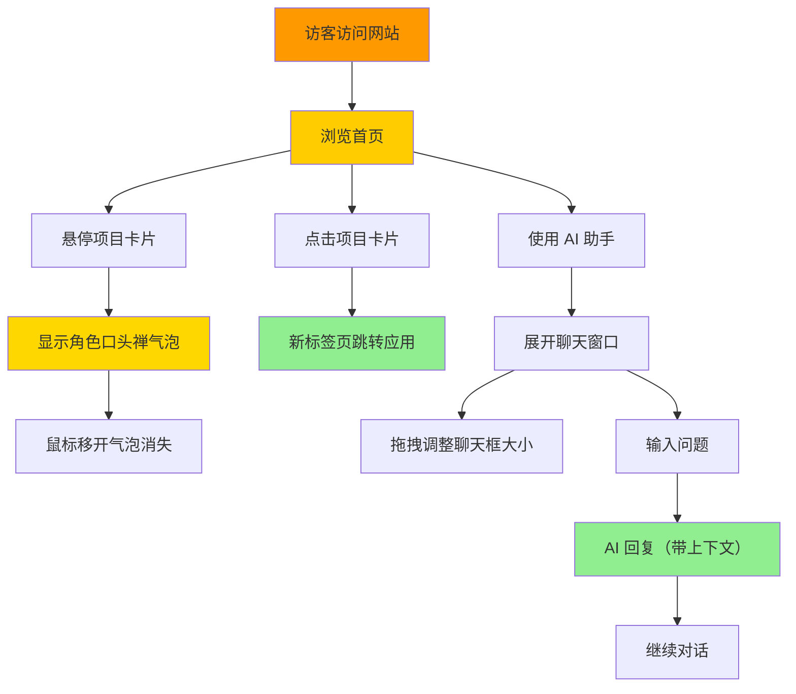

# PRD-V0.3: 七龙珠主题个人作品集 - 互动增强版

---

## 文档基础信息

| 字段 | 内容 |
|------|------|
| **PRD 版本** | V0.3 |
| **产品名称** | 个人编程作品展示网页（七龙珠主题） |
| **开发者** | Double兔 |
| **创建日期** | 2025-02-06 |
| **目标版本** | V0.3 互动增强版 |
| **核心目标** | 让网站更生动有趣，AI 更懂项目和站长，提升用户体验 |

---

## 产品概述

### 版本定位
V0.3 在 V0.2（文章功能）基础上，专注于**互动体验增强**和**AI 智能化**，让静态的网站变得生动有趣，同时让 AI 助手真正"懂"项目和站长。

### 核心价值
- **趣味性**：悬停动画 + 角色口头禅，让网站"活"起来
- **智能化**：AI 记住对话上下文，了解文章内容，更像"真人"
- **易用性**：可调整聊天框大小，更好的交互体验

---

## 用户旅程地图



### 阶段划分
1. **互动探索** - 访客悬停在卡片上发现口头禅彩蛋
2. **项目体验** - 访客点击卡片跳转到实际应用
3. **智能对话** - 访客与 AI 多轮交流，了解项目细节
4. **个性化体验** - 访客调整聊天框大小，获得舒适体验

---

## 用户故事

### US-01: 角色口头禅

**用户故事**
> 作为访客，我希望悬停在项目卡片上时能看到角色的口头禅，这样能感受到七龙珠的主题趣味性。

**业务规则与逻辑**

| 项目 | 角色 | 口头禅 |
|------|------|--------|
| 极简记账本 | 孙悟空 🐒 | 龟派气功！💥 |
| 个人工具主页 | 贝吉塔 🧍 | 终极闪光！⚡ |
| 极简海报编辑器 | 比克 👽 | 魔贯光杀炮！🌟 |
| AI 漫剧剧本 | 特兰克斯 ⚔ | 燃烧攻击！🔥 |
| 自由画布 AI 对话 | 布尔玛 🔧 | 胶囊科技！💊 |

**交互设计**
- 触发方式：鼠标悬停在卡片上
- 显示位置：卡片顶部中央
- 气泡样式：角色 emoji + 口头禅文字，金色渐变背景
- 消失时机：鼠标移开卡片

**ASCII 线框图**
```
    ┌─────────────────────────────┐
    │   💊 胶囊科技！💊           │ ← 气泡（悬停时显示）
    │         ↓                    │
    │ ┌─────────────────────────┐ │
    │ │ 🔧                  →   │ │
    │ │ 自由画布 AI 对话        │ │
    │ │ 多模型 AI 对话工具      │ │
    │ └─────────────────────────┘ │
    └─────────────────────────────┘
```

**异常处理**
- 无

**验收标准**
- [ ] 悬停在卡片上时显示口头禅气泡
- [ ] 气泡位置在卡片顶部中央
- [ ] 鼠标移开卡片后气泡消失
- [ ] 5 个项目的口头禅正确显示

---

### US-02: 悬停动画效果

**用户故事**
> 作为访客，我希望悬停时有流畅的动画效果，这样网站感觉更有活力。

**业务规则与逻辑**

| 元素 | 动画效果 |
|------|----------|
| 项目卡片 | 缩放 1.05 倍 + 上移 5px + 阴影增强 |
| 角色 emoji | 缩放 1.2 倍 + 旋转 5 度 + 透明度 0.8 |
| 龙珠 | 缩放 1.15 倍 + 旋转 10 度 + 光晕增强 |
| 光效扫过 | 渐变从左到右扫过卡片（仅在 hover 时） |

**CSS 动画定义**

```css
/* 角色 emoji 弹跳动画 */
@keyframes character-bounce {
  0%, 100% { transform: scale(1) rotate(0deg); }
  25% { transform: scale(1.1) rotate(-5deg); }
  75% { transform: scale(1.1) rotate(5deg); }
}

.character-emoji:hover {
  animation: character-bounce 0.5s ease-in-out;
}

/* 能量光晕脉冲动画 */
@keyframes energy-pulse-glow {
  0%, 100% {
    box-shadow: 0 0 20px var(--dragon-orange),
                0 0 40px rgba(255, 107, 0, 0.3);
  }
  50% {
    box-shadow: 0 0 40px var(--dragon-gold),
                0 0 60px var(--dragon-orange),
                0 0 80px rgba(255, 215, 0, 0.5);
  }
}

.energy-glow {
  animation: energy-pulse-glow 2s ease-in-out infinite;
}
```

**异常处理**
- 无

**验收标准**
- [ ] 悬停卡片时动画流畅自然
- [ ] 角色 emoji 有弹跳旋转效果
- [ ] 龙珠有能量光晕脉冲效果
- [ ] 光效扫过仅在 hover 时触发
- [ ] 所有动画不影响点击功能

---

### US-03: AI 多轮对话

**用户故事**
> 作为访客，我希望 AI 能记住我们的对话内容，这样我不用每次都重复上下文。

**业务规则与逻辑**

| 功能 | 说明 |
|------|------|
| 聊天历史 | 保存最近 20 条对话记录 |
| 持久化 | 使用 localStorage 保存 |
| 上下文传递 | 每次请求将历史记录发送给 API |
| 欢迎消息 | 不计入历史记录，不计入 API 请求 |

**数据流**
```
用户输入 → 构建历史记录 → 发送 API → AI 回复 → 显示气泡
    ↓
保存到 localStorage
```

**异常处理**
| 场景 | 处理 |
|------|------|
| localStorage 失败 | 降级运行，不保存历史 |
| 历史记录过大 | 只保留最近 20 条 |

**验收标准**
- [ ] AI 能记住对话上下文
- [ ] 刷新页面后聊天记录恢复
- [ ] 支持 20 条历史记录
- [ ] 欢迎消息不计入历史

---

### US-04: AI 文章知识

**用户故事**
> 作为访客，我希望 AI 能回答关于文章内容的问题，这样我能更好地了解站长的技术分享。

**业务规则与逻辑**

| 功能 | 说明 |
|------|------|
| 文章来源 | 从本地 JSON 文件读取最新 5 篇 |
| 内容处理 | 每篇取前 500 字作为摘要 |
| 注入方式 | 拼接到 System Prompt 中 |
| 无需向量 | 不使用 OpenAI/Upstash，直接喂给 AI |

**System Prompt 扩展**

```
## 站长文章（最新 5 篇摘要）

### 《新手小白用Claude Code门槛高？Claude+Trae搭配方案》
解决新手痛点：Claude（CLI命令行难）+ 科学上网麻烦 → 教你用...

### 《第六课：不懂Claude code？用Trae也能完成作业全流程》
复刻云舒老师的AI工具主页，亲测Trae比Claude更适合小白入门...

（更多文章...）
```

**异常处理**
| 场景 | 处理 |
|------|------|
| 无文章 | 显示"暂无文章" |
| 文章读取失败 | 显示"加载文章失败" |
| 文章过长 | 截取前 500 字 |

**验收标准**
- [ ] AI 能回答关于文章内容的问题
- [ ] 提到具体文章时能正确引用
- [ ] 无文章时不报错
- [ ] 不依赖额外 API（OpenAI/Upstash）

---

### US-05: 文章标题编辑

**用户故事**
> 作为管理员，我希望能在管理页面直接修改文章标题，这样不需要重新上传文章。

**业务规则与逻辑**

| 功能 | 说明 |
|------|------|
| 触发位置 | 文章管理页面，"修改标题"按钮 |
| 交互方式 | 弹出 prompt 输入新标题 |
| 数据更新 | 更新 JSON 文件 + updatedAt 时间戳 |
| 反馈 | 成功：Toast 提示 + 刷新列表；失败：Toast 提示错误 |

**API 设计**

| 端点 | 方法 | 功能 |
|------|------|------|
| `/api/articles` | PATCH | 更新文章标题 |

**请求体**
```json
{
  "id": "article-id",
  "title": "新标题"
}
```

**异常处理**
| 场景 | 处理 |
|------|------|
| 文章不存在 | 404 + "文章不存在" |
| 标题为空 | 400 + "缺少文章 ID 或新标题" |
| JSON 解析失败 | 500 + "更新文章失败" |

**验收标准**
- [ ] 点击"修改标题"弹出输入框
- [ ] 输入新标题后更新成功
- [ ] 修改失败有错误提示
- [ ] 修改后列表自动刷新

---

### US-06: 聊天框大小调整

**用户故事**
> 作为访客，我希望能调整聊天框的大小，这样我可以在不同屏幕上获得更好的体验。

**业务规则与逻辑**

| 功能 | 说明 |
|------|------|
| 默认高度 | 500px（比 V0.2 的 350-450px 更大） |
| 最小高度 | 300px |
| 最大高度 | 800px |
| 调整方式 | 拖拽顶部金色手柄 |
| 持久化 | 保存到 localStorage |
| 移动端支持 | 触摸拖拽 |

**交互设计**
```
┌─────────────────────────────┐
│ ════════ 拖拽调整大小 ════════ │ │ ← 金色手柄（可拖拽）
├─────────────────────────────┤
│ 🐒 AI 助手         🗑️ ✕     │
├─────────────────────────────┤
│ [聊天内容区域]               │
│ ...                        │
├─────────────────────────────┤
│ [输入框] [发送]              │
└─────────────────────────────┘
```

**技术实现**
- 监听 `mousedown` / `touchstart` 开始拖拽
- 监听 `mousemove` / `touchmove` 计算新高度
- 监听 `mouseup` / `touchend` 结束拖拽
- 高度限制在 300-800px 之间

**异常处理**
| �景 | 处理 |
|------|------|
| localStorage 失败 | 降级运行，使用默认高度 |

**验收标准**
- [ ] 拖拽顶部手柄可调整大小
- [ ] 高度限制在 300-800px
- [ ] 调整后高度自动保存
- [ ] 刷新页面后高度保持
- [ ] 移动端支持触摸拖拽

---

## 技术架构

### 技术栈

| 层级 | 技术 |
|------|------|
| 前端框架 | Next.js 15 (App Router) |
| 语言 | TypeScript |
| 样式 | Tailwind CSS + CSS-in-JS |
| 数据存储 | 本地 JSON 文件 + localStorage |
| AI API | 火山引擎 API（豆包） |
| 部署 | Vercel |

### 文件结构

```
app/
├── components/
│   ├── ProjectCard.tsx        # 项目卡片（口头禅 + 悬停动画）
│   ├── DragonBall.tsx          # 龙珠（悬停效果）
│   ├── CatchphraseBubble.tsx   # 口头禅气泡
│   └── AIWidget.tsx            # AI 聊天框（可调整大小）
├── lib/
│   ├── articles.ts             # 文章数据管理（新增 updateArticleTitle）
│   └── (RAG 文件已移除)        # V0.3 使用简单 RAG
├── api/
│   ├── chat/route.ts           # 聊天 API（增强 System Prompt + 多轮对话）
│   └── articles/route.ts       # 文章 API（新增 PATCH 方法）
└── admin/
    └── articles/page.tsx       # 文章管理（新增编辑标题功能）
```

### API 设计

| 端点 | 方法 | 功能 |
|------|------|------|
| `/api/chat` | POST | AI 对话（支持历史记录 + 文章上下文） |
| `/api/articles` | PATCH | 更新文章标题 |

---

## 验收标准

### 功能验收
- [ ] 悬停卡片显示口头禅气泡
- [ ] 所有悬停动画流畅自然
- [ ] AI 支持多轮对话，记住上下文
- [ ] AI 能回答关于文章内容的问题
- [ ] 可在管理页面修改文章标题
- [ ] 可拖拽调整聊天框大小

### 兼容性验收
- [ ] Chrome 浏览器正常
- [ ] Safari 浏览器正常
- [ ] 移动端浏览器正常
- [ ] 触摸拖拽调整大小正常

### 核心验证点
> **你能把网站发给朋友，朋友能悬停卡片看到口头禅，调整聊天框大小，与 AI 多轮对话，AI 能回答关于你文章的问题。**

---

## 非目标（V0.3 不做）

- [ ] RAG 向量搜索（OpenAI + Upstash，成本高，用简单方案替代）
- [ ] 文章内容编辑（只支持标题编辑）
- [ ] 聊天记录导出
- [ ] 角色动画点击触发（V0.3 仅悬停）
- [ ] 后台管理界面升级（保持简单）

---

## 附录

### V0.3 功能清单

| 功能 | 状态 | 说明 |
|------|------|------|
| 角色口头禅 | ✅ | 悬停显示口头禅气泡 |
| 悬停动画 | ✅ | 卡片/角色/龙珠动画效果 |
| AI 多轮对话 | ✅ | 聊天历史 + localStorage |
| AI 文章知识 | ✅ | 简单 RAG，无需向量库 |
| 文章标题编辑 | ✅ | 管理页面可修改标题 |
| 聊天框调整大小 | ✅ | 拖拽手柄 + 持久化 |

### 项目链接更新

| 项目 | 链接 |
|------|------|
| 极简记账本 | https://minimal-ledger.vercel.app/ |
| 个人工具主页 | https://homepage-personal-tools.vercel.app/ |
| 极简海报编辑器 | https://poster-editor-delta.vercel.app/ |
| AI 漫剧剧本 | https://app-90i4helcqosh.appmiaoda.com/ |
| 自由画布 AI 对话 | https://12f8be26246f45e9813b7f2d41dc8d35-latest.preview.enter.pro/ |

---

*PRD 创建时间：2025-02-06*
*PRD 版本：V0.3*
*上一步：V0.2 文章功能*
*下一步：提交 GitHub + 创建标签*
