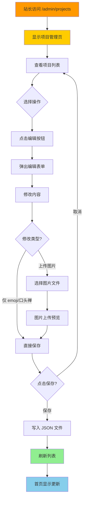

# PRD-V0.4: 七龙珠主题个人作品集 - 项目管理简化版

---

## 文档基础信息

| 字段 | 内容 |
|------|------|
| **PRD 版本** | V0.4 |
| **产品名称** | 个人编程作品展示网页（七龙珠主题） |
| **开发者** | Double兔 |
| **创建日期** | 2025-02-06 |
| **完成日期** | 2025-02-08 |
| **目标版本** | V0.4 项目管理简化版 |
| **核心目标** | 让站长可以快速修改项目的 emoji、口头禅和角色图片，不需要改代码 |

---

## 产品概述

### 版本定位
V0.4 在 V0.3（互动增强版）基础上，专注于**项目管理功能简化**，让站长能够快速调整项目的视觉元素（emoji、口头禅、角色图片），同时修复龙珠星星排列问题。

### 核心价值
- **快速修改**：一键编辑 emoji、口头禅和角色图片
- **简单直观**：表单简洁，支持图片上传
- **主题完美**：修复龙珠星星排列，使用 SVG 绘制真正的五角星
- **图片优先**：支持上传角色图片，优先于 emoji 显示

---

## 用户旅程地图



### 阶段划分
1. **查看列表** - 站长查看所有项目（含图片预览）
2. **编辑信息** - 站长修改 emoji、口头禅或上传图片
3. **保存数据** - 修改保存到本地 JSON
4. **首页更新** - 首页显示最新内容（优先显示图片）

---

## 用户故事

### US-01: 查看项目列表

**用户故事**
> 作为站长，我希望在管理页面看到所有项目的列表，包括角色图片/emoji，以便了解当前有哪些项目，并可以快速编辑它们。

**业务规则与逻辑**

| 字段 | 说明 |
|------|------|
| 角色 | 七龙珠角色图片（优先）或 emoji |
| 项目名称 | 项目标题 |
| 口头禅 | 悬停时显示的台词（如"龟派气功！💥"）|
| 链接 | 项目跳转 URL |
| 操作 | 编辑按钮 |

**显示优先级**：
- 如果有 `imageUrl` → 显示角色图片（56x56px，圆角，金色边框）
- 如果没有 `imageUrl` → 显示 emoji

**交互设计**

```
┌─────────────────────────────────────────────────────────┐
│  项目管理                                                │
├─────────────────────────────────────────────────────────┤
│  ┌───────────────────────────────────────────────────┐  │
│  │ [角色图]  极简记账本              龟波气功！💥    [编辑]  │  │
│  │    https://minimal-ledger.vercel.app/            │  │
│  └───────────────────────────────────────────────────┘  │
│  ┌───────────────────────────────────────────────────┐  │
│  │ 🧍  个人工具主页            终极闪光！⚡    [编辑]  │  │
│  │    https://homepage-personal-tools.vercel.app/    │  │
│  └───────────────────────────────────────────────────┘  │
│  ┌───────────────────────────────────────────────────┐  │
│  │ 👽  极简海报编辑器          魔贯光杀炮！🌟   [编辑]  │  │
│  │    https://poster-editor-delta.vercel.app/        │  │
│  └───────────────────────────────────────────────────┘  │
│  ...（更多项目）                                        │
└─────────────────────────────────────────────────────────┘
```

**异常处理**
- 无项目时显示："暂无项目"

**验收标准**
- [x] 显示所有 5 个项目
- [x] 优先显示角色图片，否则显示 emoji
- [x] 每个项目显示名称、口头禅、链接
- [x] 每个项目右侧有 [编辑] 按钮
- [x] 卡片样式符合七龙珠主题（金色边框 + 橙色光晕）

---

### US-02: 编辑项目信息

**用户故事**
> 作为站长，我希望点击编辑按钮后能快速修改项目的 emoji、口头禅，甚至上传角色图片，这样我就能使用真正的七龙珠角色图片。

**业务规则与逻辑**

| 字段 | 类型 | 必填 | 说明 |
|------|------|------|------|
| 角色图片 | 文件 | ❌ | 支持 JPG/PNG/GIF/WebP，最大 2MB |
| emoji | 文本 | ❌ | 七龙珠角色 emoji（如 🐒🧍👽⚔🔧）|
| 口头禅 | 文本 | ✅ | 悬停时显示的台词（如"龟派气功！💥"）|

**验证规则**：
- emoji 和图片至少需要一个
- 口头禅不能为空
- 图片格式：JPG、PNG、GIF、WebP
- 图片大小：最大 2MB

**交互设计**

```
┌─────────────────────────────────────────────────────────┐
│  编辑项目                                       ✕       │
├─────────────────────────────────────────────────────────┤
│  项目名称                                                │
│  ┌─────────────────────────────────────────────────┐    │
│  │ 极简记账本（只读）                                │    │
│  └─────────────────────────────────────────────────┘    │
│                                                          │
│  角色图片（可选，优先于 Emoji）                           │
│  ┌─────────────────────────────────────────────────┐    │
│  │            [预览图]                        ✕   │    │
│  └─────────────────────────────────────────────────┘    │
│  ┌─────────────────────────────────────────────────┐    │
│  │         📷 点击上传图片                          │    │
│  └─────────────────────────────────────────────────┘    │
│  支持 JPG、PNG、GIF、WebP，最大 2MB                    │
│                                                          │
│  Emoji（角色）                                          │
│  ┌─────────────────────────────────────────────────┐    │
│  │ 🐒                                             │    │
│  └─────────────────────────────────────────────────┘    │
│  [快速选择按钮区域]                                      │
│                                                          │
│  口头禅                                                 │
│  ┌─────────────────────────────────────────────────┐    │
│  │ 龟派气功！💥                                    │    │
│  └─────────────────────────────────────────────────┘    │
│                                                          │
│  ┌──────────────┐  ┌──────────────┐                     │
│  │    取消      │  │    保存      │                     │
│  └──────────────┘  └──────────────┘                     │
└─────────────────────────────────────────────────────────┘
```

**操作流程**
1. 点击项目的 [编辑] 按钮
2. 弹出编辑表单
3. 可选择：
   - 上传角色图片（显示预览，可删除）
   - 修改 emoji（提供快速选择按钮）
   - 修改口头禅
4. 点击 [保存] → 保存到 JSON + 刷新列表 + 提示"保存成功"
5. 点击 [取消] 或 ✕ → 关闭表单

**图片上传流程**
```
选择文件 → 格式验证 → 大小验证 → 上传到 /public/projects/
→ 返回图片 URL → 预览显示
```

**异常处理**
| 场景 | 处理 |
|------|------|
| emoji 和图片都为空 | 提示"请输入 emoji 或上传图片" |
| 口头禅为空 | 提示"请输入口头禅" |
| 图片格式错误 | 提示"只支持 JPG、PNG、GIF、WebP" |
| 图片大小超限 | 提示"图片大小不能超过 2MB" |
| 保存失败 | 提示"保存失败，请重试" |

**验收标准**
- [x] 点击 [编辑] 按钮弹出表单
- [x] 表单预填充当前值（包括图片预览）
- [x] 支持上传图片，显示预览，可删除
- [x] 提供 emoji 快速选择按钮（30个）
- [x] 图片保存到 `/public/projects/` 目录
- [x] 保存后更新 JSON 文件
- [x] 首页优先显示图片，否则显示 emoji
- [x] 显示成功/失败提示

---

### US-03: 修复龙珠星星排列

**用户故事**
> 作为站长，我希望主页上的七颗龙珠能正确显示星星排列，每颗星都是真正的五角星形状，这样才符合七龙珠动漫的设定。

**业务规则与逻辑**

每颗龙珠的星星排列方式：

| 龙珠 | 星星排列 | 说明 |
|------|----------|------|
| 一星球 | 中间 1 颗 ★ | 单星居中 |
| 二星球 | 上下竖排 ★★ | 两星纵向 |
| 三星球 | 三角形 ★★★ | 三点成三角 |
| 四星球 | 菱形 ★★★★ | 四点成菱形 |
| 五星球 | 五角星形 ★★★★★ | 五点成星形 |
| 六星球 | 五边形+中心 ★★★★★★ | 五点成星形 + 中心一点 |
| 七星球 | 六边形+中心 ★★★★★★★ | 六点成六边形 + 中心一点 |

**技术实现方案**

使用 SVG 绘制真正的五角星形状（★）：

```tsx
// 绘制五角星形状
function Star({ cx, cy, size }: { cx: number; cy: number; size: number }) {
  const points: [number, number][] = [];
  const outerRadius = size;
  const innerRadius = size * 0.4;

  for (let i = 0; i < 10; i++) {
    const radius = i % 2 === 0 ? outerRadius : innerRadius;
    const angle = (Math.PI / 5) * i - Math.PI / 2;
    points.push([cx + radius * Math.cos(angle), cy + radius * Math.sin(angle)]);
  }

  const pointsStr = points.map(p => p.join(',')).join(' ');
  return <polygon points={pointsStr} fill="var(--star-red)" />;
}
```

**验收标准**
- [x] 7 颗龙珠正确显示
- [x] 每颗龙珠的星星排列符合动漫设定
- [x] 星星是真正的五角星形状（★）
- [x] 星星颜色为红色（var(--star-red)）
- [x] 龙珠悬停效果保持不变

---

## 技术架构

### 技术栈

| 层级 | 技术 |
|------|------|
| 前端框架 | Next.js 15 (App Router) |
| 语言 | TypeScript |
| 样式 | Tailwind CSS + CSS-in-JS |
| 图形 | SVG（五角星绘制） |
| 数据存储 | 本地 JSON 文件 |
| 文件上传 | FormData API |
| 部署 | Vercel |

### 文件结构

```
app/
├── app/
│   ├── components/
│   │   ├── DragonBall.tsx          # 龙珠组件（SVG 五角星）
│   │   ├── ProjectEditModal.tsx     # 项目编辑弹窗（含图片上传）
│   │   └── ProjectCard.tsx          # 项目卡片（支持图片显示）
│   ├── lib/
│   │   └── projects.ts              # 项目数据管理（含 imageUrl）
│   ├── api/
│   │   ├── projects/route.ts        # 项目 CRUD API
│   │   └── upload/image/route.ts    # 图片上传 API（新增）
│   ├── data/
│   │   └── projects.json            # 项目数据存储（含 imageUrl）
│   ├── public/
│   │   └── projects/                # 角色图片存储目录（新增）
│   └── admin/
│       └── projects/page.tsx        # 项目管理页（支持图片预览）
```

### 数据结构

```typescript
interface Project {
  id: string;
  emoji: string;          // 角色 emoji（备用）
  title: string;
  description: string;
  link: string;
  catchphrase: string;
  imageUrl?: string;      // 角色图片 URL（可选，优先级高于 emoji）
}
```

### API 设计

| 端点 | 方法 | 功能 | 请求体 |
|------|------|------|--------|
| `/api/projects` | GET | 获取项目列表 | - |
| `/api/projects` | PATCH | 更新项目 | `{ id, emoji?, catchphrase?, imageUrl? }` |
| `/api/upload/image` | POST | 上传图片 | FormData { file } |

---

## 验收标准

### 功能验收
- [x] 项目管理页面正常显示
- [x] 5 个项目正确展示（含图片/emoji）
- [x] 点击 [编辑] 弹出表单
- [x] 支持上传角色图片（JPG/PNG/GIF/WebP）
- [x] 支持修改 emoji 和口头禅
- [x] 提供 30 个 emoji 快速选择按钮
- [x] 保存后数据正确写入 JSON
- [x] 首页优先显示图片，否则显示 emoji
- [x] 7 颗龙珠星星排列正确（真正的五角星）

### 兼容性验收
- [x] Chrome 浏览器正常
- [x] Safari 浏览器正常
- [x] 移动端浏览器正常

### 核心验证点
> **你能在本地运行 `npm run dev`，访问 `/admin/projects` 修改项目的角色图片、emoji 和口头禅，保存后刷新首页看到修改生效。**

---

## 非目标（V0.4 不做）

- [ ] 新增项目
- [ ] 删除项目
- [ ] 调整项目顺序
- [ ] 登录认证
- [ ] 数据库迁移（Prisma + Neon）
- [ ] 文章管理（V0.2 已有）
- [ ] 留言管理（V0.5 再做）

---

## 附录

### V0.4 功能清单

| 功能 | 状态 | 说明 |
|------|------|------|
| 查看项目列表 | ✅ | 显示所有项目，支持图片预览 |
| 编辑项目信息 | ✅ | 支持修改 emoji、口头禅、上传图片 |
| 图片上传功能 | ✅ | 支持 JPG/PNG/GIF/WebP，最大 2MB |
| Emoji 快速选择 | ✅ | 30 个预设 emoji 按钮 |
| 修复龙珠星星排列 | ✅ | SVG 绘制真正的五角星 |

### 项目数据结构

```json
{
  "projects": [
    {
      "id": "1",
      "emoji": "",
      "title": "极简记账本",
      "description": "简洁高效的记账工具",
      "link": "https://minimal-ledger.vercel.app/",
      "catchphrase": "龟波气功！💥",
      "imageUrl": "/projects/project-1234567890-abc123.webp"
    }
  ]
}
```

### 七龙珠星星排列参考

```
一星球: ★
二星球: ★
         ★
三星球:   ★
        ★   ★
四星球:   ★
       ★   ★
         ★
五星球:     ★
           ★ ★
          ★   ★
六星球:   ★
         ★ ★
        ★ ★
七星球:     ★
          ★ ★
         ★   ★
        ★ ★ ★
```

---

*PRD 创建时间：2025-02-06*
*PRD 完成时间：2025-02-08*
*PRD 版本：V0.4 Final*
*上一步：V0.3 互动增强版*
*下一步：V0.5 留言板功能*
