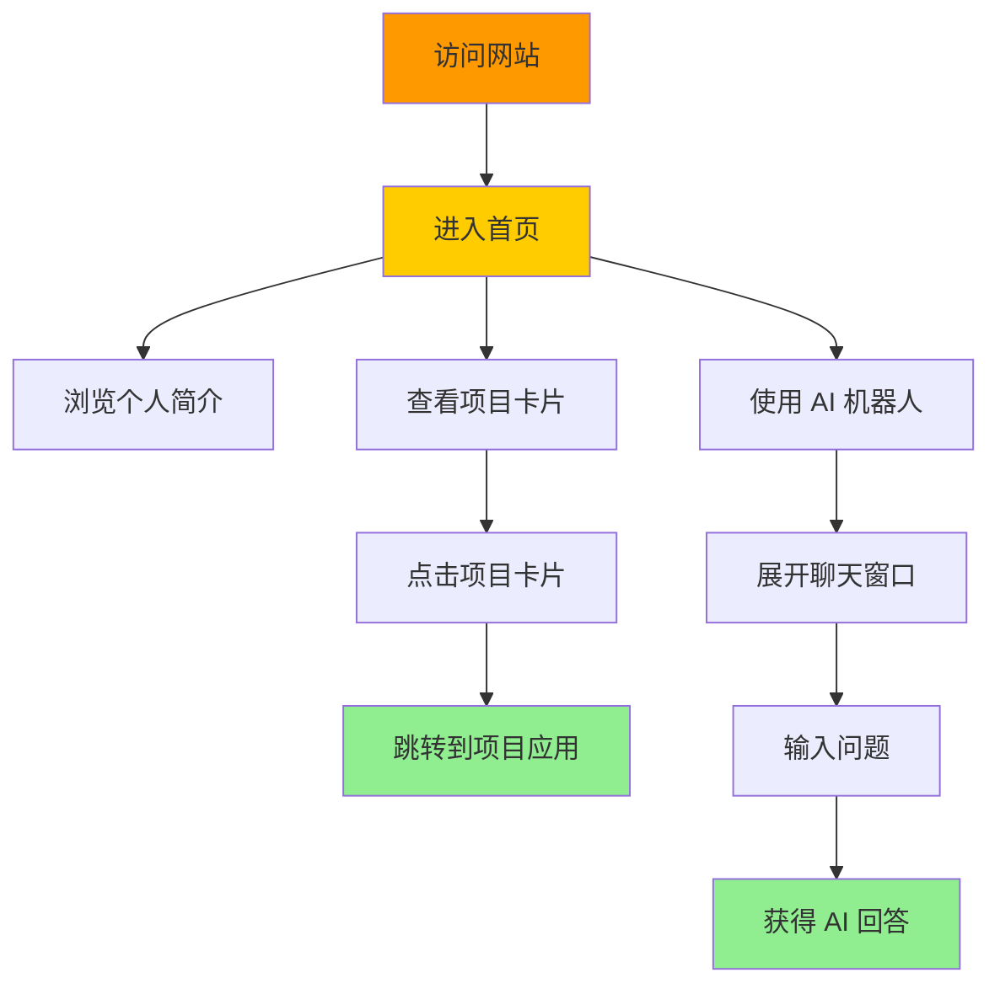
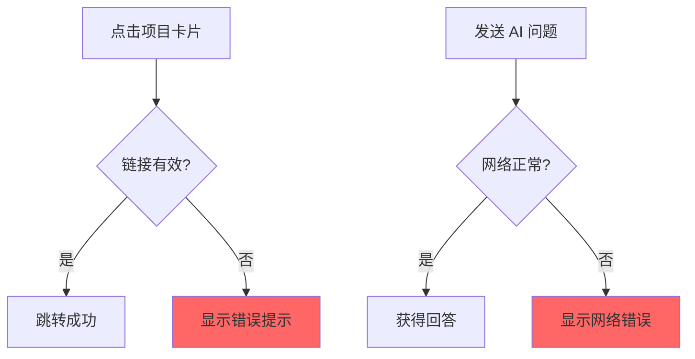

# V0.1 核心用户操作流程

## 访客流程

```mermaid
flowchart TD
    A[访问网站] --> B[进入首页]
    B --> C[浏览个人简介]
    B --> D[查看项目卡片]
    B --> E[使用 AI 机器人]
    
    D --> F[点击项目卡片]
    F --> G[跳转到项目应用]
    
    E --> H[展开聊天窗口]
    H --> I[输入问题]
    I --> J[获得 AI 回答]
    
    style A fill:#ff9900
    style B fill:#ffcc00
    style G fill:#90EE90
    style J fill:#90EE90
```

## 异常流程

```mermaid
flowchart TD
    A[点击项目卡片] --> B{链接有效?}
    B -->|是| C[跳转成功]
    B -->|否| D[显示错误提示]
    
    E[发送 AI 问题] --> F{网络正常?}
    F -->|是| G[获得回答]
    F -->|否| H[显示网络错误]
    
    style D fill:#ff6666
    style H fill:#ff6666
```
